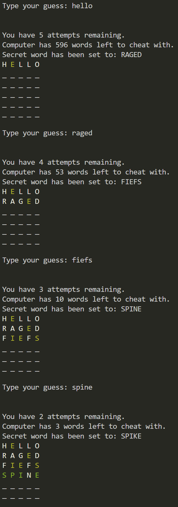
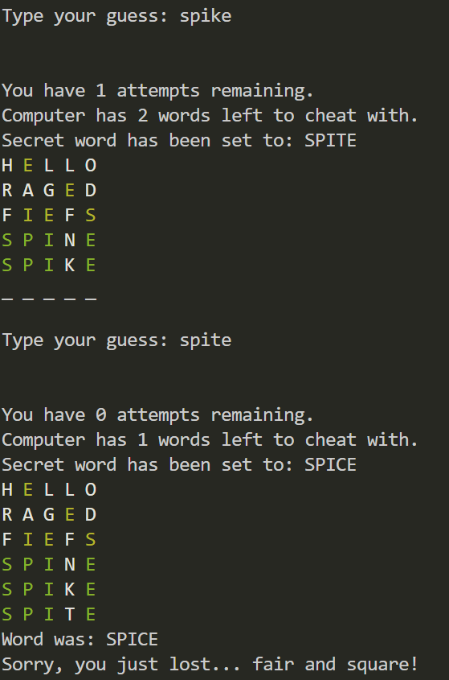

# Wongdle: the greedy wordle

Wongdle is a version of wordle where the computer tries to cheat its human opponent by delaying the win as much as possible, till the user runs out of attempts.

As a daily wordle user, I wanted to know if I could make a wordle that was unbeatable, so decided to try and code it up.

## Greedy Algorithm
In wordle, the user is given hints based on their guessed word against the "secret" word. 
If the letter is green, it means the character is in the correct position, and the same position as the "secret" word.
If the letter is yellow, it means the character is present in the "secret" word, but is in the wrong position.
If the letter is grey, it means the character is not present at all in the "secret" word.

The algorithm works by taking the user's guess, and going through each possible word that matches the hint pattern generated, and then grouping all those words together. The greedy part will select the pattern group with the largest list of words, and then use that pattern to decide on which secret word to pick. If the user guesses the secret word, the computer will change its secret word, as long as the changed word still has the same pattern as the guessed word hints. 

For example:

